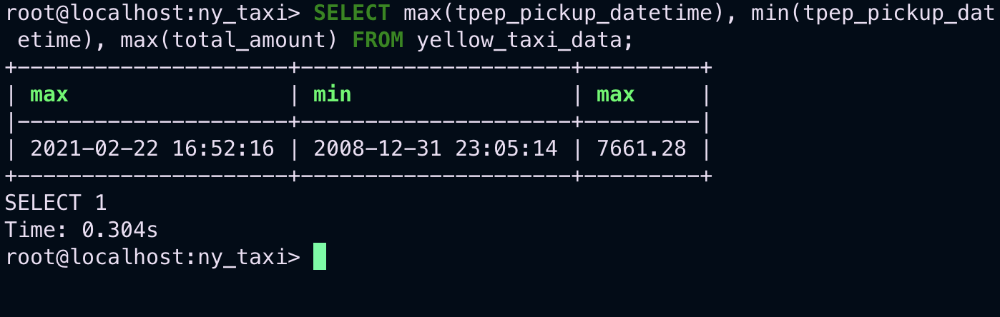
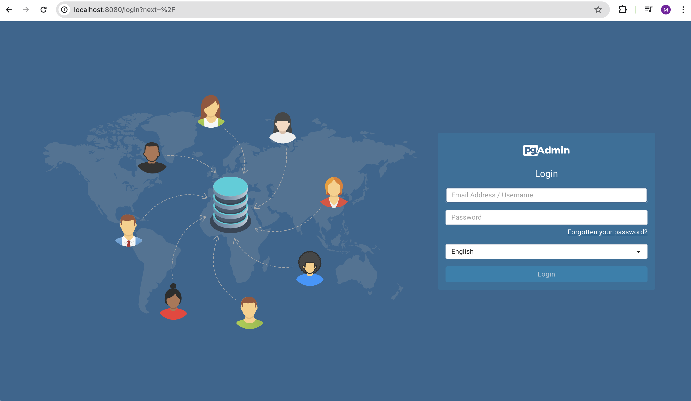
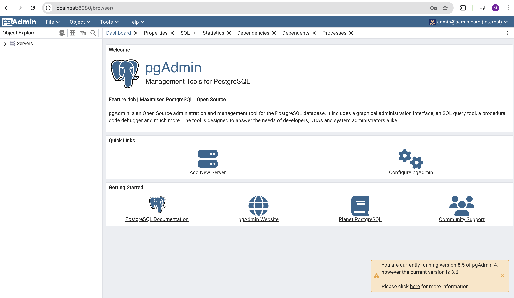
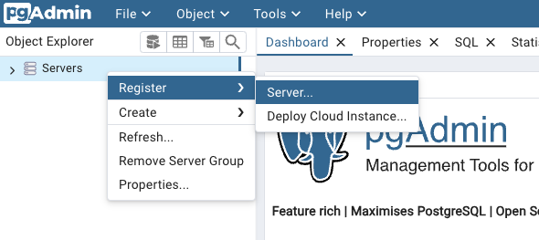
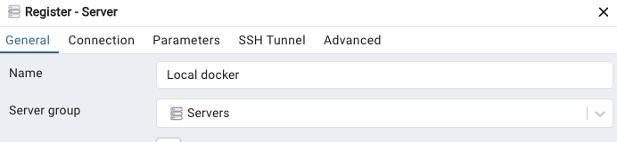
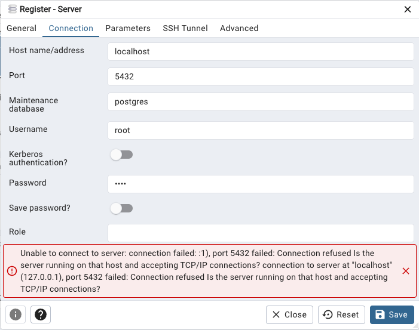
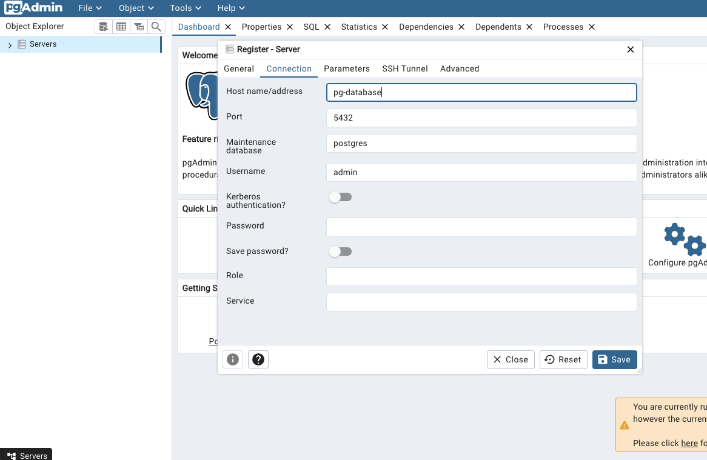
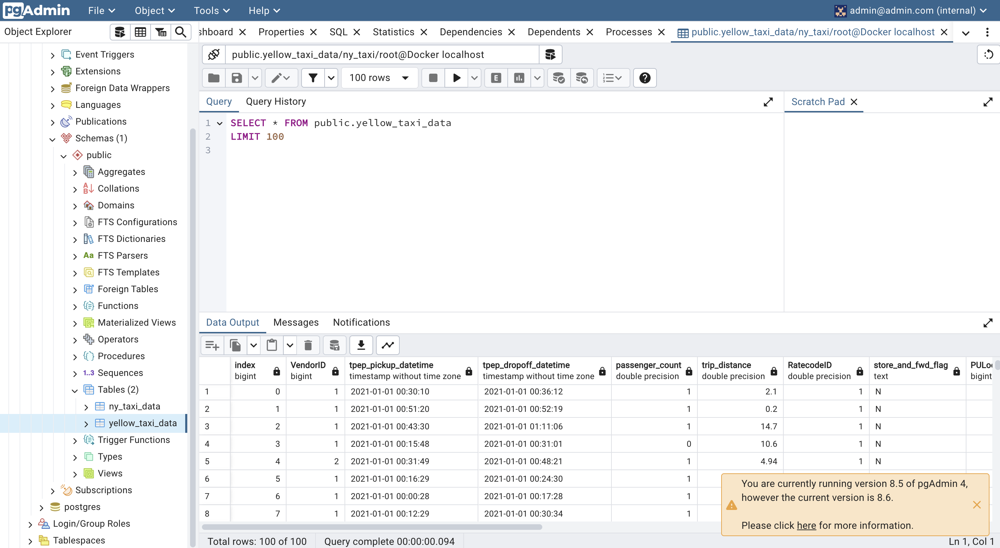

# Connecting pgAdmin and Postgres with Docker networking

## Terminology

- `pgAdmin`: PGAdmin is a web-based Graphical User Interface (GUI) management application used to communicate with Postgres and derivative relational databases on both local and remote servers.
- `Postgres`: is a powerful, open source object-relational database system that uses and extends the SQL language combined with many features that safely store and scale the most complicated data workloads.
- `Docker networking`: Docker networking enables a user to link a Docker container to as many networks as the user requires. 

## Useful links

- pgAdmin [official page](https://www.pgadmin.org/).

## What is pgAdmin?

We can start looking at our database in the postgres CLI by doing

```SQL
SELECT max(tpep_pickup_datetime), min(tpep_pickup_datetime), max(total_amount) 
FROM yellow_taxi_data;
```

wich will give us something like this:



But interacting this way with the database is not great. For a more convenient way we will use pgAdmin which is a web based GUI tool.

Instead of installing it, we will use dokcer to install a container with pgAdmin, tu run the container we will use:

```bash
docker run -it \
  -e PGADMIN_DEFAULT_EMAIL="admin@admin.com" \
  -e PGADMIN_DEFAULT_PASSWORD="root" \
  -p 8080:80 \
  dpage/pgadmin4
```

remembre, we use `-e` to declare environment variables, `-p` to do port mapping, so here:

- `PGADMIN_DEFAULT_EMAIL` is the default username we will use to login in pgAdmin.
- `PGADMIN_DEFAULT_PASSWORD` is the default password.
- `8080:80` 8080 is our local machine port and we will send request to the port 80 on the container.
- `dpage/pgadmin4` is the pgAdmin image.

we the run this, and in our browser we go to `localhost:8080` and we will see something like this: 



here we use the credentials we give as environment variables. And we will get something like:



We now need to create a server, for wich we do:



We then put a name to our server:



and then go to the `Connection` tab and add the `Host name` to `localhost` and use `root` as the username and password like we did with our engine to load the database, **BUT** we will encounter a problem:



Why is that? It's because we are running the pgAdmin **inside** a container, different to the container where we are running postgres. So, when we put `localhost` in the pgAdmin `Host name`, pgAdmin goes and look for `localhost` and it will be the container in wich we are running pgAdmin. We need to conect them, to do this we do `Docker Network`. 

First, let's stop both containers. Then we need to create the docker network by doing:

```bash
docker  network create pg-network
```
here:

- `pg-network` is the name of the network we want to create.

Now, we need to initiate the postgres container in this way:


```bash
docker run -it \
    -e POSTGRES_USER="root" \
	-e POSTGRES_PASSWORD="root" \
	-e POSTGRES_DB="ny_taxi" \
    -v $(pwd)/ny_taxi_postgres_data:/var/lib/postgresql/data \
	-p 5432:5432 \
    --network=pg-network \
    --name pg-database \
    postgres:13  
```
here:

- `--networking=pg-network` is where we specify the name of the network.
- `--name pg-database` is the name wich pgAdmin will use to discover the database.

And now we need to initiate the pgAdmin container with:

```bash
docker run -it \
  -e PGADMIN_DEFAULT_EMAIL="admin@admin.com" \
  -e PGADMIN_DEFAULT_PASSWORD="root" \
  -p 8080:80 \
  --network=pg-network \
  --name pg-admin \
  dpage/pgadmin4
```
here:

- `--networking=pg-network` is where we specify the name of the network.
- `--name pg-admin` is the name of this container.

Notes:

- **IMPORTANT: these are example values for testing and should never be used on production. Change them accordingly when needed.**
- pgAdmin is a web app and its default port is 80; we map it to 8080 in our localhost to avoid any possible conflicts.
- Just like with the Postgres container, we specify a network and a name. However, the name in this example isn't really necessary because there won't be any containers trying to access this particular container.


We now run this and go to our webrowser and go to `localhost:8080`, and now we create a server, for wich we do:


We then put a name to our server:


and then go to the `Connection` tab and add the `Host name` to `pg-database` and use `root` as the username and password like we did with our engine to load the database like this:



we save, and we will have our server! Now, lets say we want to look at the first 100 rows we do: 

(Right Side Menu) > Docker localhost > Databases > ny_taxi > Schemas > public > Tables > yellow_taxi_data > (left_click) > View/Edit Data > First 100 Rows, and we will have something like this:

