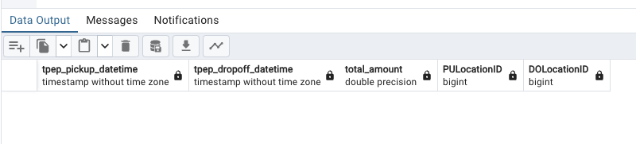
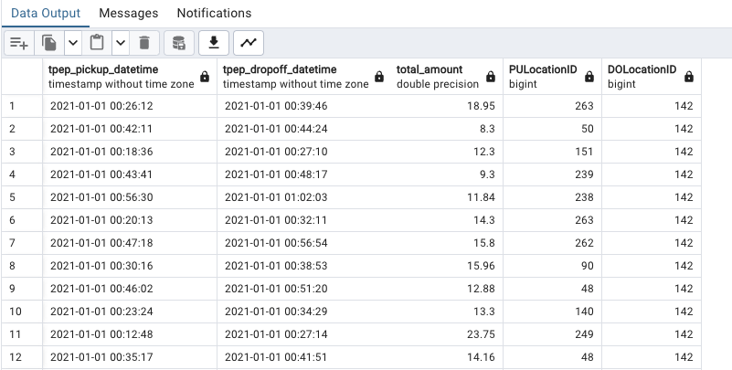
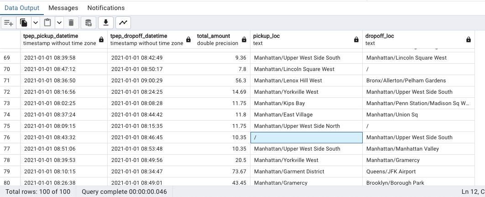

## Terminology

- `SQL`: means Structured Query Language. SQL is a standard language for database creation and manipulation. 

## Useful links

- SQL joins: [link](https://www.wikiwand.com/en/Join_(SQL))

## What is SQL?

So, SQL is a standard language for database creation and manipulation. This part of the lecture is to remember how SQL works. We are gonna use the `yellow_taxi_trips` data we have in pgAdmin and also we are gonna use this [zone data](https://s3.amazonaws.com/nyc-tlc/misc/taxi+_zone_lookup.csv).

So basically we have this tables to work with:

- `yellow_taxi_trips`: list of all yelow taxi trips of NYC for January 2021.
- `zones`: list of zone IDs for pick ups and drop offs.

So lets say we want to:

### 1) Question 1

- Selects all rows in the `yellow_taxi_trips` table. If there are more than 100 rows, select only the first 100. We would do:

```SQL
SELECT
    *
FROM
    yellow_taxi_trips t,
    zones zpu,
    zones zdo
WHERE
    t."PULocationID" = zpu."LocationID" AND
    t."DOLocationID" = zdo."LocationID"
LIMIT 100;
```
A few notes on this:

- We select all rows in the trips table. If there are more than 100 rows, select only the first 100.
- We give aliases to the trips and zones tables for easier access.
- We replace the IDs inside PULocationID and DOLocationID with the actual zone IDs for pick ups and drop offs.
- We use double quotes ("") for the column names because in Postgres we need to use them if the column names contains capital letters.

### 2) Question 2

- We only want the pickup time, the dop off time, how much the drive was, and the zones. For this we would do:

```SQL
SELECT
    tpep_pickup_datetime,
    tpep_dropoff_datetime,
    total_amount,
    CONCAT(zpu."Borough", '/', zpu."Zone") AS "pickup_loc",
    CONCAT(zdo."Borough", '/', zdo."Zone") AS "dropoff_loc"
FROM
    yellow_taxi_trips t JOIN zones zpu
        ON t."PULocationID" = zpu."LocationID"
    JOIN zones zdo
        ON t."DOLocationID" = zdo."LocationID"
LIMIT 100;
```

### 3) Question 3

- We wanna see if there is a NULL in the pickup zone:

```SQL
SELECT
    tpep_pickup_datetime,
    tpep_dropoff_datetime,
    total_amount,
    "PULocationID",
    "DOLocationID"
FROM
    yellow_taxi_trips t
WHERE
    "PULocationID" is NULL
LIMIT 100;
```

### 4) Question 4

- Cheking for Location ID's in the `zones` table not in the `yellow_taxi_trips`:

```SQL
SELECT
    tpep_pickup_datetime,
    tpep_dropoff_datetime,
    total_amount,
    "PULocationID",
    "DOLocationID"
FROM
    yellow_taxi_trips t
WHERE
    "DOLocationID" NOT IN (
        SELECT "LocationID" FROM zones
    )
LIMIT 100;
```



But what if we delete, for example, all the rows in the table `zones` with `LocationID` of 142. First, we delete them with:

```SQL
DELETE FROM 
    zones 
WHERE 
    "LocationID" = 142;
```

and now if we run again:

```SQL
SELECT
    tpep_pickup_datetime,
    tpep_dropoff_datetime,
    total_amount,
    "PULocationID",
    "DOLocationID"
FROM
    yellow_taxi_trips t
WHERE
    "DOLocationID" NOT IN (
        SELECT "LocationID" FROM zones
    )
LIMIT 100;
```

we will get a list of rows with `PULocationID` of 142: 



So, because this is a more real scenario (where some data is missing), is also more convenient to do a left join to get the pickup time, the dop off time, how much the drive was, and the zones. For this we would do:

```SQL
SELECT
    tpep_pickup_datetime,
    tpep_dropoff_datetime,
    total_amount,
    CONCAT(zpu."Borough", '/', zpu."Zone") AS "pickup_loc",
    CONCAT(zdo."Borough", '/', zdo."Zone") AS "dropoff_loc"
FROM
    yellow_taxi_trips t LEFT JOIN zones zpu
        ON t."PULocationID" = zpu."LocationID"
    LEFT JOIN zones zdo
        ON t."DOLocationID" = zdo."LocationID"
LIMIT 100;
```

Look at what we get if we run this query:



we can see that we get a `/` where we don't know the location.

### 5) Question 5

- Counts the amount of records in the `yellow_taxi_trips` table grouped by day.

```SQL
SELECT
    CAST(tpep_pickup_datetime AS DATE) as "day",
    COUNT(1)
FROM
    yellow_taxi_trips t
GROUP BY
    CAST(tpep_pickup_datetime AS DATE)
ORDER BY "day" ASC;
```

### 6) Question 6

- Counts the amount of records in the `yellow_taxi_trips` table grouped by day, ordered by counts, and display displays them in descending order, so that the day with the highest amount of trips is shown first. Also show the maximum amount that a driver earned in a trip for that day and the maximum passenger count on a single trip for that day.

```SQL
SELECT
    CAST(tpep_pickup_datetime AS DATE) as "day",
    COUNT(1) as "count",
    MAX(total_amount) as "max_amount",
    MAX(passenger_count) as "max_passenger"
	FROM
    yellow_taxi_trips t
GROUP BY
    CAST(tpep_pickup_datetime AS DATE)
ORDER BY "count" DESC;
```

### 7)  Question 7

- Counts the amount of records in the `yellow_taxi_trips` table grouped by day AND location ID, ordered by day and location id, and displays them in ASCENDING order. Also show the maximum amount that a driver earned in a trip for that day and the maximum passenger count on a single trip for that day. 

```SQL
SELECT
    CAST(tpep_pickup_datetime AS DATE) as "day",
    "DOLocationID",
    COUNT(1) as "count",
    MAX(total_amount) as "max_amount",
    MAX(passenger_count) as "max_passenger"
FROM
    yellow_taxi_trips t
GROUP BY
    1, 2
ORDER BY
    "day" ASC,
    "DOLocationID" ASC;
```