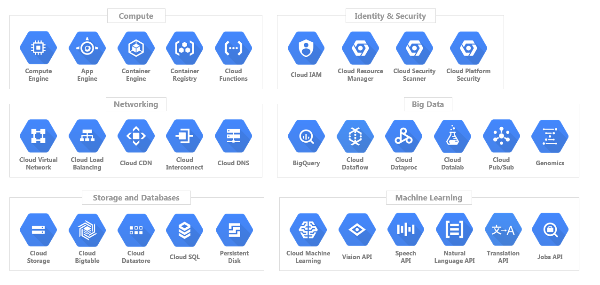

## Terminology

- `GCP`: The Google Cloud console provides a web-based, graphical user interface that you can use to manage your Google Cloud projects and resources.

## Useful links

- [Google Cloud](https://cloud.google.com/)

## What is GCP?

GCP stands for Google Cloud Plataform, and it's a:

- Cloud computing services offered by google.
- Includes a range of hosted services for compute, storage and application development that runs on Google hardware.
- Same hardware on which google runs its service.

## What are we doing?

In the following chapters we will setup a Data Lake on Google Cloud Storage and a Data Warehouse in BigQuery. We will explore these concepts in future lessons but a Data Lake is where we would usually store data and a Data Warehouse provides a more structured way to access this data.

We need to setup access first by assigning the Storage Admin, Storage Object Admin, BigQuery Admin and Viewer IAM roles to the Service Account, and then enable the `iam` and `iamcredentials` APIs for our project.

1. Assign the following IAM Roles to the Service Account: Storage Admin, Storage Object Admin, BigQuery Admin and Viewer.
    - On the GCP Project dashboard, go to IAM & Admin > IAM
    - Select the previously created Service Account and edit the permissions by clicking on the pencil shaped icon on the left.
    - Add the following roles and click on Save afterwards:
        - `Storage Admin`: for creating and managing buckets.
        - `Storage Object Admin`: for creating and managing objects within the buckets.
        - `BigQuery Admin`: for managing BigQuery resources and data.
        - `Viewer` should already be present as a role.

2. Enable APIs for the project (these are needed so that Terraform can interact with GCP):
    - https://console.cloud.google.com/apis/library/iam.googleapis.com
    - https://console.cloud.google.com/apis/library/iamcredentials.googleapis.com

3. Make sure that the `GOOGLE_APPLICATION_CREDENTIALS` environment variable is set.