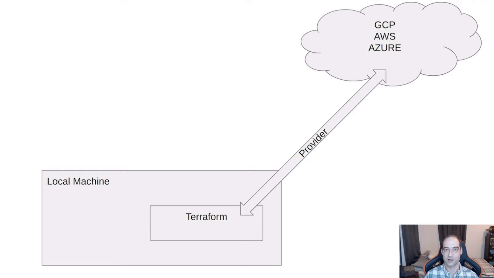
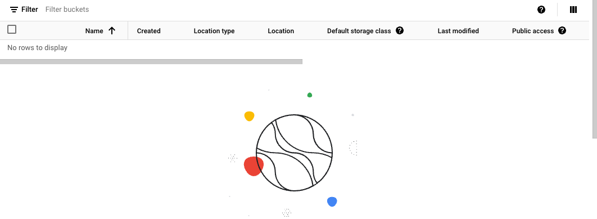
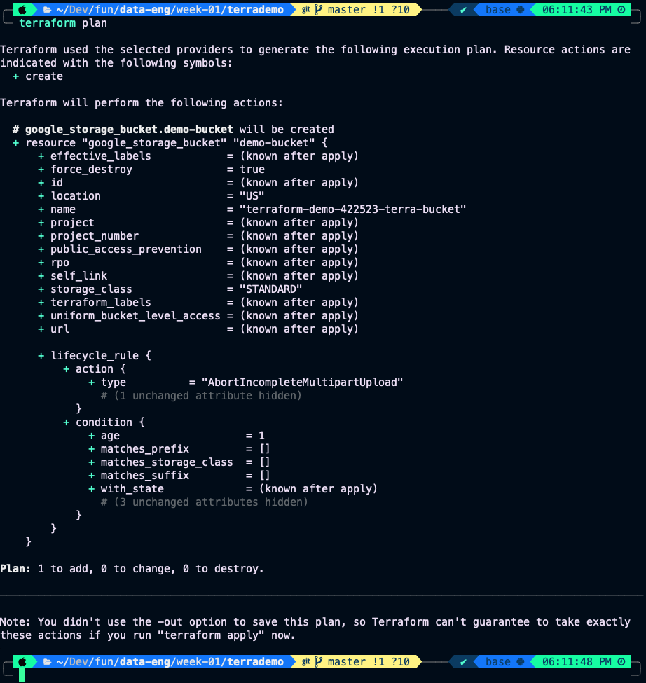

## Terminology

- `Terraform`:  is an infrastructure as code tool that lets you build, change, and version cloud and on-prem resources safely and efficiently.
- `Infrastructure as Code (IaC)`: is the managing and provisioning of infrastructure through code instead of through manual processes.

## Useful links

- [Terraform](https://www.terraform.io/)

## What is Terraform?

Terraform is an infrastructure as code tool that lets you build, change, and version cloud and on-prem resources safely and efficiently.

### Why Terraform:

- Simplicity in keeping track of infraestructure.
- Easier collaboration.
- Reproducibility.
- Ensure resources are removed.

## How Terraform works?



## What are providers?

Code that allows terraform to communicate to manage resources on, for example:

- AWS
- Azure
- GCP
- Kubernetes
- etc.

## Key Terraform Commands

1. `terraform init`:
    - Initializes & configures the backend, installs plugins/providers, & checks out an existing configuration from a version control.

2. `terraform plan`:
    - Matches/previews local changes against a remote state, and proposes an Execution Plan.

3. `terraform apply`:
    - Asks for approval to the proposed plan, and applies changes to cloud.

4. `terraform destroy`:
    - Removes your stack from the Cloud.

### Creating `main.tf` file 

You can go and google `terraform google provider` click in the first link and copy the `use provider` code:


then in the brackets of `provider "google"` put the example usage code.

One nice trick is that you can type in the terminal:

```bash
terraform fmt
```

to get your `main.tf` file formatted. Now you can copy and paste your `project-id` on `project`.

## Initializing terraform

Now, we need a way to tell terraform how to use our credentials, for this we can do something like:

```bash
export GOOGLE_CREDENTIALS='/Users/manuelandersen/Developer/fun/data-eng/week-01/terrademo/keys/my-creds.json'
```

you can check this by doing:

```bash
echo $GOOGLE_CREDENTIALS
```

Now we can run:

```bash
terraform init
```
to get the provider, here:

- provider means the piece of code that terraform is going tou use to talk to GCP. 

Our JSON credential files gives us acces to the resources, the provider will be the `"PATH"`.

More intuitively, the provider gets us to the door, and our JSON credential files opens the door.

## Creating a storage bucket on GCP

First you go to:


and you can see that we dont have any bucket:



So, if you type in google terraform google cloud storage bucket you can acces this [link](https://registry.terraform.io/providers/hashicorp/google/latest/docs/resources/sto) where we can copy and paste the example:

```terraform
resource "google_storage_bucket" "auto-expire" {
  name          = "auto-expiring-bucket"
  location      = "US"
  force_destroy = true

  lifecycle_rule {
    condition {
      age = 1
    }
    action {
      type = "AbortIncompleteMultipartUpload"
    }
  }
}
```

Now we can run a:

```bash
terraform plan
```
and we should get something like this:



And now we can deploy this with:

```bash
terraform apply
```

it will ask for your approval, you type `yes`, and then it will create a JSON file in your directory with the bucket. And if we look at our Cloud Strage Buckets we will see that it was created:


We will use this in a project or whatever. Now we can get rid of this with:

```bash
terraform destroy
```

And, 

::: {.callout-warning}
use terraform .gitignore if you are pushin code to github.
:::

## Big Query Dataset

So, lets make some more interesting, like a `Big Query Dataset`. For this we need to add to our `main.tf` the next lines:

```terraform
resource "google_bigquery_dataset" "demo_dataset" {
  dataset_id = "demo_dataset"
}
```

here:

- `google_bigquery_dataset` is the resource.
- `demo_dataset` is the name we give to the resource within the terraform files.

## Using variables 

By convention we would use a file called `variables.tf` for our variables.

We define in our `variables.tf` the next variables:

```terraform
variable "project" {
    description = "Project"
    default = "terraform-demo-422523"
}

variable "region" {
    description = "Region location"
    default = "us-central1"
}

variable "location" {
    description = "Project Location"
    default = "US"
}

variable "bq_dataset_name" {
    description = "My BigQuery Dataset Name"
    default = "demo_dataset"
}

variable "cgs_bucket_name" {
    description = "My Storage Bucket Name"
    default = "terraform-demo-422523-terra-bucket"
}

variable "gcs_storage_class" {
  description = "Bucket Storage Class"
  default = "STANDARD"
}
```

so in our `main.tf` we can write:

```terraform
terraform {
  required_providers {
    google = {
      source  = "hashicorp/google"
      version = "5.28.0"
    }
  }
}

provider "google" {

  project = "terraform-demo-422523"
  region  = var.location
}

resource "google_storage_bucket" "demo-bucket" {
  name          = var.cgs_bucket_name
  location      = var.region
  force_destroy = true

  lifecycle_rule {
    condition {
      age = 1
    }
    action {
      type = "AbortIncompleteMultipartUpload"
    }
  }
}

resource "google_bigquery_dataset" "demo_dataset" {
  dataset_id = var.bq_dataset_name
  location = var.location
}
```

this is way better if we are working in this project with other people and we want to quickly change the value of some variable.

## Changing the acces to credentials

Remember that we declare the `GOOGLE_CREDENTIALS` by exporting them, so to unset them we do:

```bash
unset GOOGLE_CREDENTIALS
```

so now if we do `terraform plan` it should fail. Now we can put the `credentials` in a variable in our `variables.tf` file:

```terraform
variable "credentials" {
    description = "My Credentials"
    default = file("./keys/my-creds.json")
}
```

we also need to include this variable in our `main.tf` file this way, with a function called `file()`:

```terraform
variable "credentials" {
    description = file(var.credentials)
    default = file("./keys/my-creds.json")
}
```

Always remember to do:

```bash
terraform destroy
```